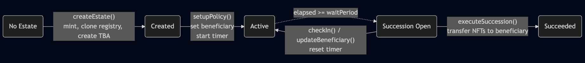

# Succession-Controlled NFTs

An ERC-721 extension enabling registry-controlled transfers for on-chain succession.

**Status:** Preparing for ERC submission. Community feedback welcome.

[](LICENSE)
[](LICENSE-INTERFACES)
[](https://soliditylang.org/)

## What This Is

A minimal standard for NFTs that delegate transfer authority to succession registries. Combined with ERC-6551 token-bound accounts, a single NFT can control an entire digital estate. When succession conditions are met, one registry call transfers everything.

## Why This Matters

If you die tomorrow, your family can't access your crypto. Social recovery is designed for lost keys, not planned succession. Multisigs require active coordination. Custodial services defeat the purpose of self-custody.

This standard provides automatic, trustless succession. No centralized platforms, no ongoing fees, fully self-sovereign.

## Quick Start
```bash
git clone https://github.com/perdura/succession-controlled-nfts
cd succession-controlled-nfts
forge install
forge test
```

84 tests, all passing.

## Testnet

Live on Sepolia with an example estate. See [TESTNET.md](./TESTNET.md) for addresses and interaction instructions.

## How It Works

Mint an NFT, deploy a registry, link token-bound accounts, configure your policy. If you stop checking in, your beneficiary claims control.



The reference implementation's `EstateFactory` bundles creation into one transaction:
```solidity
// Create estate: NFT + Registry + TBA in one transaction
(uint256 tokenId, address registry, address tba) = factory.createEstate();

// Set succession policy (6 months inactivity, bob as beneficiary)
SimpleSuccessionRegistry(registry).setupPolicy(bob, WaitPeriod.SIX_MONTHS);

// Stay active by checking in periodically
SimpleSuccessionRegistry(registry).checkIn();

// After inactivity period, beneficiary can claim
SimpleSuccessionRegistry(registry).executeSuccession(alice);
```

## Architecture

Two minimal interfaces define the standard:

**IERC721SuccessionControlled** - ERC-721 extension. When `successionRegistryOf(user)` returns non-zero, only that registry can transfer the user's tokens.

**ISuccessionRegistry** - Policy verification. `isSuccessionOpen(subject)` returns true when conditions are met. `executeSuccession(subject)` transfers the NFT.

The reference implementation adds:

- **ControllerNFT** - One mint per user, factory-authorized registries, inheritance limits
- **SimpleSuccessionRegistry** - Time-based inactivity with check-ins (6-month or 1-year wait)
- **EstateFactory** - Atomic deployment of NFT + Registry + ERC-6551 TBA via EIP-1167 clones

## Gas Costs

| Operation | Gas |
|-----------|-----|
| createEstate() | ~384,000 |
| setupPolicy() | ~27,000 |
| checkIn() | ~8,400 |
| executeSuccession() | ~100,000 |

## Project Structure
```
contracts/
  interfaces/
    IERC721SuccessionControlled.sol
    ISuccessionRegistry.sol
  reference/
    ControllerNFT.sol
    SimpleSuccessionRegistry.sol
    EstateFactory.sol
test/
  BaseTest.t.sol
  ControllerNFT.t.sol
  SimpleSuccessionRegistry.t.sol
  EstateFactory.t.sol
  IntegrationTests.t.sol
```

## Documentation

- [ERC Specification](./docs/erc.md)
- [Security Considerations](./docs/SecurityConsiderations.md)

## Security

This implementation has not been audited. Key protections:

- Registry-only transfers (approve/transferFrom disabled)
- Inheritance limits (MAX_INHERITED_TOKENS = 8) to prevent griefing  
- Immutable registry authorization per user
- Reentrancy guards on state-changing functions

For production use, get a professional audit.

## License

- **Interfaces**: CC0-1.0 (public domain)
- **Reference Implementation**: MIT

## Links

- [GitHub](https://github.com/perdura/succession-controlled-nfts)
- [Ethereum Magicians Discussion](https://ethereum-magicians.org/t/draft-erc-succession-controlled-nfts/27662)

---

Tian, 2026